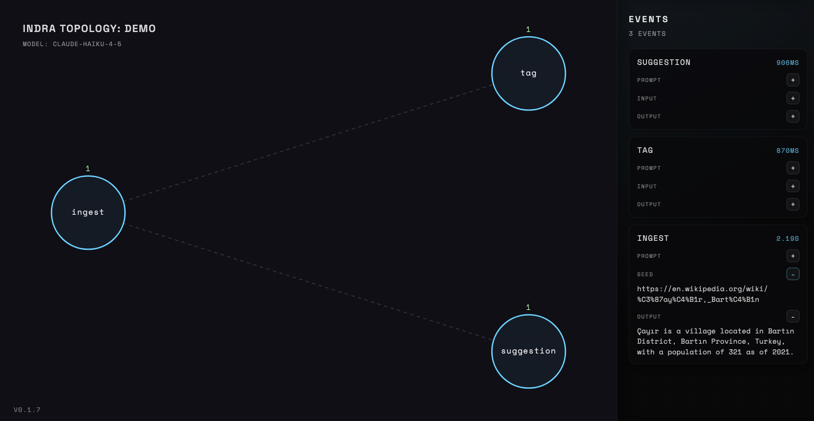

🔥 **Indra** is an Event Processing system for AI agents. 

<p align="center">
  
</p>

## Architecture

```ts
// graphs are a DAG of nodes
type Graph = {
  id: string
  name: string
  nodes: Node[]
}

// each node can define its own prompt
type Node = {
  id: string
  parentId: string | null
  prompt: string
  seed?: () => Promise<string>
}
```

## Supported LLMs

Indra currently supports only Claude.

The `CLAUDE_API_KEY` must be provided in your environment.

## Development
```bash
bun install
bun dev
```

open `http://localhost:5000` to view the topology UI
